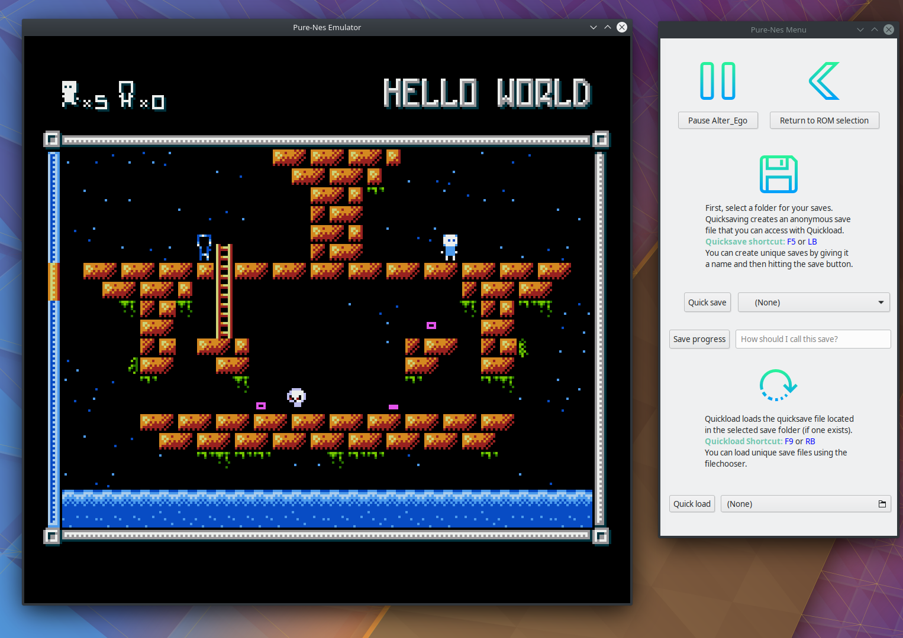
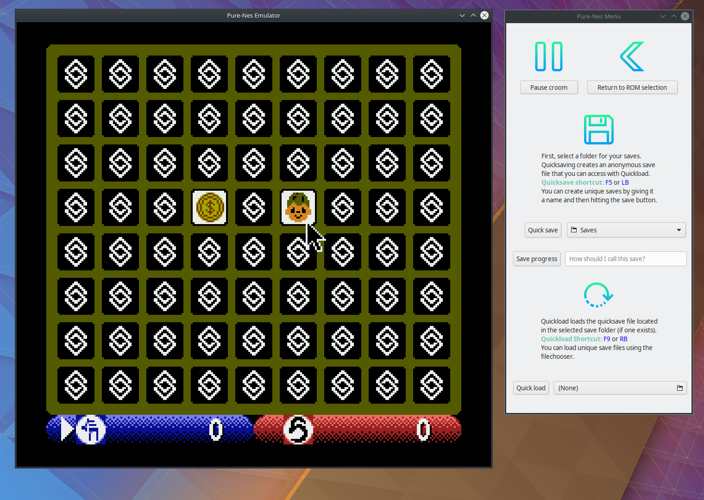

# pure-nes

[](https://dev.azure.com/tufh3g/Build/_build/latest?definitionId=1&branchName=master)





# Description
This project is a part of my Bachelor's thesis, which aims to explore 
the field of emulation using functional programming.

The main focus was to use efficient techniques in a readable fashion to achieve good performance.

The program is completely cross platform, built on top of Gtk and SDL2.

# Compatibility

Supported mappers: 0 and 2

# Build instructions for Ubuntu

# Install Gtk
```console
$ sudo apt-get install libgirepository1.0-dev libwebkit2gtk-4.0-dev libgtksourceview-3.0-dev
```

# Install SDL2
```console
$ sudo apt-get install libsdl2-dev
```

# Build the project using Make
```console
$ stack build
```

# Start the emulator
```console
$ stack exec pure-nes
```

# (Optional): Run tests to check the accuracy of the emulator
```console
$ stack test
```
