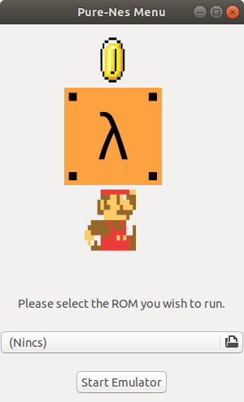

# pure-nes



# Build instructions for Ubuntu

# Install Gtk
```console
$ sudo apt-get install libgirepository1.0-dev libwebkit2gtk-4.0-dev libgtksourceview-3.0-dev
```

# Install Sdl2
```console
$ sudo apt-get install libsdl2-dev
```

# Build the project using Make
```console
$ make
```

# Start the emulator
```console
$ stack exec pure-nes
```

# (Optional): Run tests to check the accuracy of the emulator
```console
$ stack test
```
